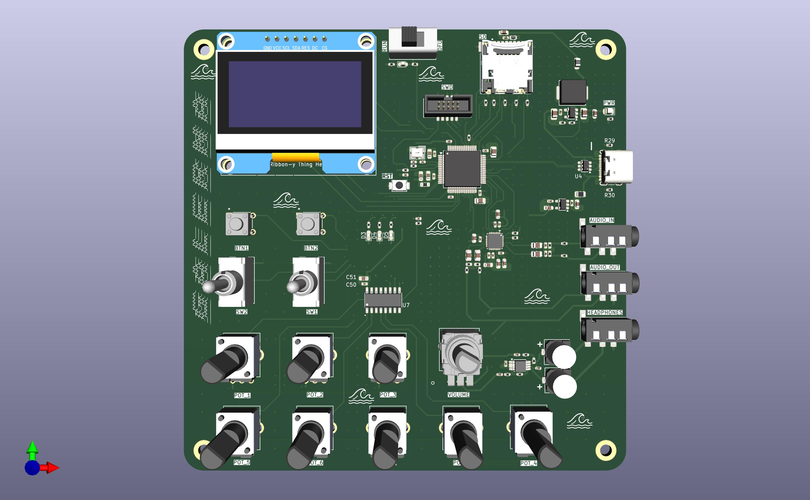

# Galerna DSP

Galerna DSP is a KiCad hardware project for an STM32-based audio effects board: two
audio channels in/out, 8 potentiometers, footswitches/buttons, an OLED display, and a
microSD slot, all built around an STM32F405.

Full design write-up — requirements, as-built BOM, power budget, codec/amp circuit
notes — lives in **[docs/Design.md](docs/Design.md)**.

## Repository layout

| Path | Contents |
|---|---|
| `GalernaDsp.kicad_pro` / `.kicad_pcb` / `.kicad_sch` | Top-level KiCad project and root schematic sheet |
| `power.kicad_sch`, `mcu.kicad_sch`, `audio_codec.kicad_sch`, `input_control.kicad_sch` | The four schematic sub-sheets |
| `libraries/Galerna/` | Project-specific KiCad symbol/footprint/3D-model library |
| `cubeMx/` | STM32CubeMX-generated firmware project for the STM32F405RGT6 (peripheral init only, no application code yet) |
| `jlcpcb/` | Manufacturing outputs for JLCPCB: gerbers, drill files, BOM/CPL for assembly |
| `docs/` | Design documentation |
| `GalernaDsp.xlsx` / `.csv` | Bill of materials |

## Opening the project

Open `GalernaDsp.kicad_pro` in KiCad (7.x). The root schematic pulls in the four
sub-sheets listed above; the PCB is a single `GalernaDsp.kicad_pcb`.

## Firmware

`cubeMx/` is a standard STM32CubeMX + CMake project. Regenerate from `cubeMx/Galerna.ioc`
in STM32CubeMX if peripheral config changes; build with CMake/CMakePresets as usual for
an STM32F4 target.

## Manufacturing

Gerbers, drill files, and JLCPCB assembly data (BOM/CPL) are pre-generated under
`jlcpcb/production_files/`.
