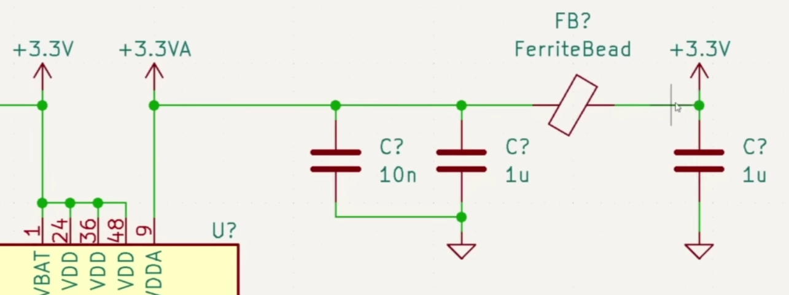
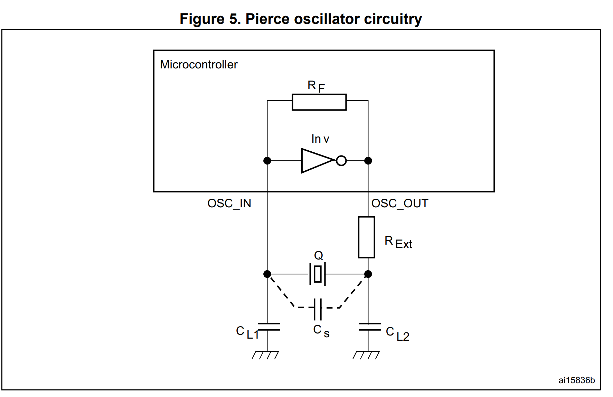

# Galerna DSP

Galerna DSP will DSP board based on STM32 to produce audio effects.

## Requirements

- Two audio channels input/output. No audio amplification.
- 48KHz / up to 24 bit sample width
- 8 potentiometers. Read through a Multiplexer
- 2 mechanical switches
- 2 buttons
- USB C powered
- SWD debug
- OLED screen SSD1306 
- IO extension header 

### Power Section 

The power of the board will be done through USB C.

There will be two power rails
 
 - 3.3V for the digital section
 - 3.3A clean analog power mostly for the Audio Codec

For that, two voltage regulators will be used.
 
 - Switching Buck regulator for digital rail
 - Low Voltage Drop (LDO) for the analog rail

## Design choices

- 4 layer board 
- No split GND for analog and digtial
- Audio Input and Output with 3.5mm Jacks.

## PARTS

IC's selected 

| Component                   | Part Name               | LCSC Part Number |
|-----------------------------|-------------------------|------------------|
| Microcontroller             | STM32F405RGT6 (LQFP-64) |                  |
| Audio Codec                 | WM8731SEDS              |                  |
| OLED Screen                 | SSD1306                 |                  |
| Multiplexer                 | CD4051BM96G4            |                  |
| Buck Switching Regulator    | TLV62569DBV             |                  |
| LDO Regulator               | SPX3819M5-L-3-3         |                  |
| USB C Receptacle            | USB4105-GF-A            |                  |
| ESD protection              | USBLC6 - 2SC6           |                  |
| Audio Jacks (x2)            | PJ-320D                 | C431535          |          

### Current estimation

Rough current consumption estimate (3.3 V rails)

#### STM32F405 (3.3 V digital rail)

ST’s datasheet typical run current at 168 MHz:

~87 mA typical with peripherals enabled (conditions-dependent)

Realistically, once you add clocks, GPIO toggling, DMA, I2S, etc., budgeting ~90–130 mA for the MCU is reasonable (more if you drive lots of IO hard or enable extra analog blocks).

##### WM8731 audio codec (mostly on 3.3 V analog rail)

WM8731 “Record and Playback” typical currents at 3.3 V rails (quiescent, no signal):

AVDD: 13.1 mA

HPVDD: 1.7 mA

DCVDD: 3.0 mA

DBVDD: 1.5 mA

Total ≈ 19.3 mA (and it can be a bit higher depending on configuration and what outputs you’re driving).

##### SSD1306 OLED (3.3 V rail)

This varies wildly with brightness and pixel fill. Many common 0.96" SSD1306 modules quote around:

~20 mA typical “depending on active pixels”

Budget 5–25 mA (and assume closer to the high end if you keep it bright).

##### CD4051 mux (3.3 V rail)

Negligible compared to the above (typically microamps to low hundreds of microamps; call it <1 mA worst-case for budgeting).

##### “Board overhead”

LEDs (if any), pullups, USB interface bits, etc.: 5–20 mA depending on what you add.

Totals (good budgeting numbers)
Digital 3V3_D (buck rail)

##### Results

STM32F405: 90–130 mA

OLED: 5–25 mA

CD4051 + buttons/switch pullups, misc: 5–15 mA

Budget 3V3_D ≈ 120–170 mA (call it 200 mA to be safe).

Analog 3V3_A (LDO rail)

WM8731: ~20 mA typical (record+play)

Plus any extra analog reference/filters you power from 3V3_A: usually small

Budget 3V3_A ≈ 25–50 mA (generous).

Whole board (from 5 V USB, through buck+LDO)

If 3V3_D is ~200 mA and 3V3_A is ~50 mA, total 3.3 V load is ~250 mA.

Power at 3.3 V: 3.3 V × 0.25 A = 0.825 W.

From 5 V input, with (say) 85–92% buck efficiency, you’re around:

~0.18–0.20 A from USB 5 V (≈ 180–200 mA)

So you’re comfortably below common USB power limits.

### Low Dropout regulator

SPX3819M5-L-3-3

Add some extra filtering for the analog parts.

Once the 3.3 V is generated, place a FerriteBead. The FerriteBead adds resistance at high frequencies.

### Buck Converter

#### Inductor calculation

$$
L = \frac{V_{out} . (V_{in} - V_{out}) }{V_{in} * f_{sw} . \Delta I_l}
$$

Where $ \Delta I_l $ is the inductor ripple current. Aim for 20%-30% of the maximum ouput current.

Expected values

$V_{out} = 3.3 V$

$V_{in} = 4.5 V$ to $ 5 V$

$f_{sw} = 1.5 MHz$

$I_{max} = 250 mA$

$\Delta I_l = 0.200 A * 0.25 = 0.0625 A$

So 

$L  = 12uH$

Used 10u

#### Posible fuse

Best choice if you want tiny, low-profile, and easy SMT routing:
👉 Littelfuse 0603L050YR — 500 mA hold, fits 0603 footprint, easy for JLCPCB to place.

Best choice if you want easier routing + hand assembly (or JLC assembled):
👉 1206SMD 500 mA PPTC Fuse — larger pads, more forgiving placement.

Best for future-proof / more robust current handling:
👉 1210 0.5 A Resettable Fuse — larger size ideal if board space allows.

## Steps

- Select componets
- Calculate power reqs
- Select Regulator

## Crystal Oscillator

R_ext and C_l for a low pass filter for harmonics higher than the crystal 

R_ext also reduces the drive strength over the crystal to reduce the harmonics.

#### Values to choose:

- Q : Crstal
- Load Capacitance : C_l1 / C_l2
- R_ext : external resistor to limit the inverter ouput current

#### Values to take into account

- Stray capacitance : C_s
- R_f : Internal feedback resistor

##### Crytal properties

- Frequency, f_0 e.g. 16Mhz 
- Load capacitance C0, e.g. 10pF 
- ESR Equivalent series resistor. e.g 80 ohms
- Package. e.g. 3225

C_s, tipically between 3pF to 5pF
C_o 9pF

C_l = 2 * (C_o - C_s)

C_l = 8pF, 12pF

R_ext  = 10% of 1 / 2*pi*f_0*C_o = 1 / 2 * pi * 24*10⁶ * 9*10^⁻12 = 73 => 100 ohm

### Connectors for GPIO

jst gh

### Footprints

Caps
22u 0805_2012
10u 0603
1u 0603_1608
10 
100n 0402_1005
1n 0402_1005 
10p 0402_1005

Leds
0402_1005 or 0603_1608

Res
0402
Ferite
0805

Inductor

### PCB design

No impedance control needed. The Only differential pair is USB FS. Not critical.

#### SD card

Look at LeDsp module SD card placement.

