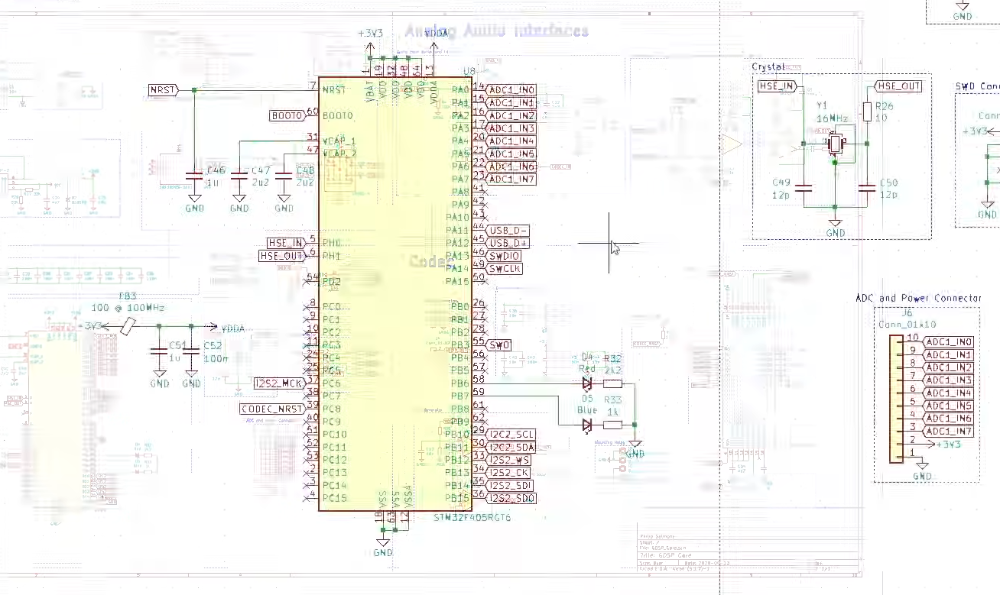
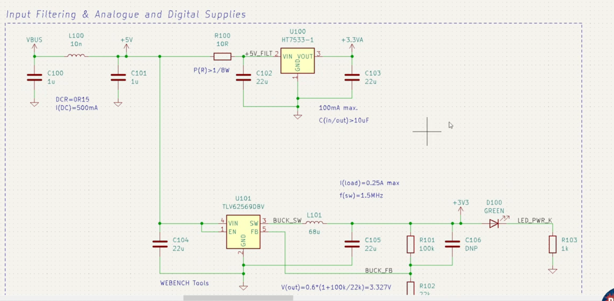

# OTHER PROJECTS

Daisy seed. It has two LDOsn

# Codecs

## Audio dsp board on video

TLV320AIC

## LeDsp

ALC5616-CGT

# MCU

## Audio DSP board on video

STM32F405

## LeDsp

STM32H743VIT6

## Course 

STM21F103CBT5

### Power

LDO : HT7533-1

BUCK : TLV62569DBV
