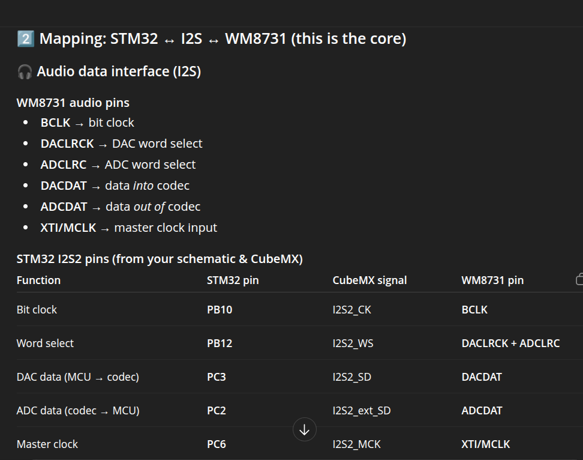

## Audio Codec 

The audio code for the project is WM8731SEDS

Use LINE IN, not MIC IN.

### Decoupling capacitors

For each supply pin (or each supply "domain" pin):

1× 100 nF MLCC placed right at that pin (same side, shortest loop to GND)

Per rail (shared):

1× bulk cap (typically 4.7-10 µF) near the codec on that rail

This gives:

- HF stability (100 nF)
- MF/LF charge storage (bulk)

##### Digital powers

10 µF (bulk)
100 nF → DVDD
100 nF → DBVDD

##### Analog powers

10 µF (bulk)
100 nF → AVDD
100 nF → HPVDD (although not use)

### Code Input

AUDIO_IN → 1k → ● → 2.2µF → CODEC_IN
                 │
                 ├─ 220k → GND
                 └─ 220p → GND

##### AC coupling capacitor: 2.2uF

- Blocks DC
- Allows WM8731 to bias the input internally to VMID.

It will form a high pass with the input impedance of the codec. From the datasheet 20-30k

f_c = 1  * 2*pi * 20k * 2.2uF = 3.6Hz 

well below audio band, 20Hz-20kHz.

### 220 ohm to GND

- Discharge path for the coupling capacitor.
- Defines input impedance when nothing is plugged in.

# RF filter 220pF/1k

Reduces RF picked up by the cable.

f_c = 1 / 2 * pi * 1k * 200pf = 723kHz.

The resistor also

- Limits currents when ESD events happen.

### Codec output

Points to considered between the codec and the 3.5 mm jacks, 

- DC compatibility (codec is biased to VMID, jacks are 0 V)
- RF / EMI filtering (cables are antennas)
- Impedance & stability (codec drivers + cable capacitance)
- Protection & robustness (ESD, hot-plugging)

Parts to cover all points

##### AC coupling capacitor (≈ 1 µF)

Blocks the codec’s DC bias (VMID ≈ 1.65 V)
Ensures the jack sees a signal centered at 0 V

Without it:

 - External gear sees DC
 - Loud pops
 - Possible damage or distortion

Value: 1 µF is enough for line-level, high-impedance loads

(Forms a high-pass filter with the load impedance)

##### Series resistor (≈ 100 Ω)

Isolates the codec from cable capacitance
Improves stability of the output driver
Reduces pop energy
Limits fault current if someone shorts the jack

Value : 100 Ω

##### Pulldown resistor (≈ 100 kΩ to GND)

- Defines the output when nothing is connected
- Prevents the jack from floating
- Reduces pops when plugging/unplugging
- It does not affect audio level (too large).

### Mapping STM32 Audio Codec

